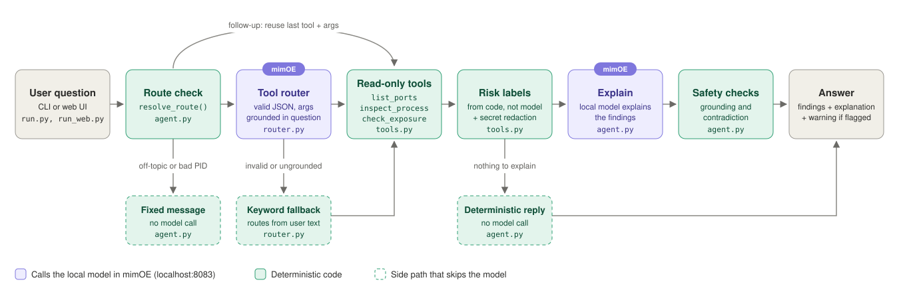
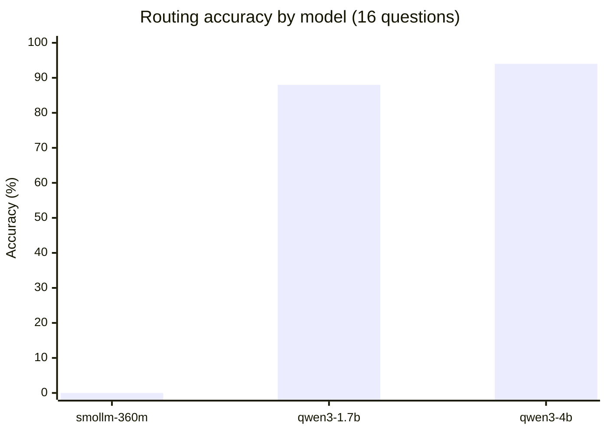
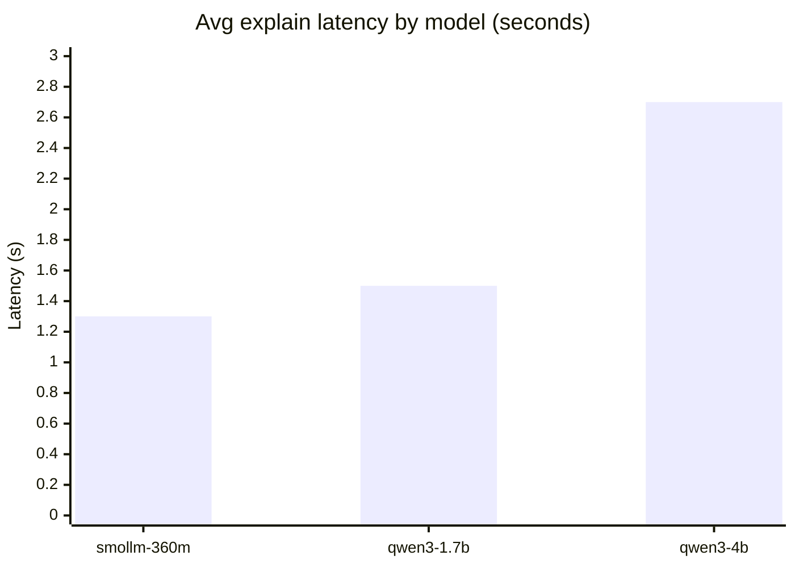

# mimoe-port-check

A small local security-check agent. It inspects listening ports and processes on this machine only, labels risk in code, and asks a model running in mimOE to explain the findings in plain language. This data is sensitive, so the agent refuses to run against anything but a localhost mimOE endpoint.

The core agent is plain HTTP calls to mimOE in a few small files; the web UI and evals are extras built on the same core.


*Web UI on qwen3-1.7b. The screenshot shows only mimOE and a local test server, no identifying system data.*

*Same agent underneath the CLI and the web UI. CLI sample transcript: [docs/DETAILS.md](docs/DETAILS.md#sample-transcript).*

## Key findings

- SmolLM2-360M scored 0/16 on routing, so the design never depends on the model to work correctly.
- Qwen3's `<think>` reasoning block consumed the entire token budget before it could answer. Fixed with a literal `/no_think` directive.
- qwen3-4b's hallucinations are more specific (fabricated port numbers) than qwen3-1.7b's, which makes them easier to believe.
- The agent flags mimOE's own endpoint as network-exposed (MEDIUM) and notes that its API key is a shared default.
- The web UI's own listening port shows up as localhost-only, confirming the server actually binds to `127.0.0.1` as designed.

## Requirements

- macOS (`lsof`/`ps` output parsing is BSD-specific).
- Python 3.10+ (tested on 3.13).
- mimOE Studio running locally, with a model loaded. `qwen3-1.7b` is recommended, see [Model comparison](#model-comparison).

## Quick start

**CLI:**

First, open mimOE Studio, go to AI Models, and load `qwen3-1.7b` (or any of the three).

```bash
python3 -m venv .venv && source .venv/bin/activate
pip install -r requirements.txt
cp .env.example .env      # edit if your mimOE setup differs from the defaults
python run.py
```

Ask `what's open on my machine?`, `what's on port 5432?`, or a follow-up like `is it risky?`. Type `exit` to quit.

**Web UI**, same agent underneath:

```bash
python run_web.py
```

Open http://127.0.0.1:8090.

**Tests:**

```bash
pip install -r requirements-dev.txt
pytest
```

## Exploring the mimOE endpoint

Base URL: `http://localhost:8083/mimik-ai/openai/v1`

```bash
curl http://localhost:8083/mimik-ai/openai/v1/chat/completions \
  -H "Authorization: Bearer 1234" \
  -H "Content-Type: application/json" \
  -d '{"model": "qwen3-1.7b", "messages": [{"role": "user", "content": "hello"}]}'
```

Before writing any code, I curled the endpoint directly. Here's what that taught me:

- It's an OpenAI-compatible `/chat/completions` endpoint. A plain `requests` POST works, no SDK needed.
- `/mimik-ai/openai/v1/models` lists whatever's currently loaded. mimOE only keeps one model loaded at a time, so switching in Studio unloads the previous one.
- The API key defaults to a shared, publicly-documented value (`1234`). I realized that's exactly why an exposed mimOE endpoint counts as a real security finding.
- Qwen3 is a reasoning model. It emits a `<think>` block by default and needs a literal `/no_think` directive to skip straight to the answer.

## Approach

- Model picks a tool via JSON, code validates and falls back to keywords. Small local models aren't reliable at structured output. Instead of trusting a framework's function-calling machinery, the agent asks the model for one small JSON object from a 3-tool whitelist and validates every field before anything runs.
- Invalid, missing, or rejected model output falls back to a deterministic keyword matcher over the user's own text. See [`router.py`](mimoe_port_check/router.py).
- Risk labels come from code, not the model. See [`tools.py`](mimoe_port_check/tools.py): HIGH (sensitive service, exposed), MEDIUM (anything else exposed), LOW (localhost-only), INFO (a recognized broadcast service like AirPlay, where exposure is expected).
- Known processes are matched by identity first, path-verified against their real executable, since a declared name is spoofable. See [docs/DETAILS.md](docs/DETAILS.md#known-process-labeling) for how, and why `mimoe` is the one exception rated MEDIUM instead of INFO.

## Framework and tooling choices

- No agent framework (LangChain, etc.). A framework's function-calling layer wouldn't fix the model-reliability problem above, and mimOE only speaks one OpenAI-compatible endpoint. A raw `requests` POST keeps every request and response visible, with no extra abstraction layer.
- `python-dotenv` handles `.env` loading. It's one of two pinned dependencies (alongside `requests`), worth it for the ergonomics over manual `os.environ` parsing.

## How the components connect



## Model comparison





- qwen3-1.7b gets most of the accuracy gain at a small latency cost. qwen3-4b roughly doubles latency for another 6 points.

| Model | Routing accuracy (16 Qs) | Avg latency (route / explain) | Explain quality |
|---|---|---|---|
| `smollm-360m` | 0% (fallback does the routing) | ~410ms / ~1.3s | Loops sentences; occasionally fabricates a finding |
| `qwen3-1.7b` | 88% | ~680ms / ~1.5s | Coherent; one invented risk framing observed |
| `qwen3-4b` | 94% | ~1.35s / ~2.7s | Coherent; hallucinations more specific (fabricated ports) |

- The agent auto-selects a model at startup, preferring `qwen3-1.7b`, then `qwen3-4b`, then `smollm-360m`. `MIMOE_MODEL` in `.env` overrides this.
- `smollm-360m` is listed last because it ships with mimOE by default. It's the weakest of the three.
- Full rationale, the `/no_think` fix, and how to reproduce: [docs/DETAILS.md](docs/DETAILS.md#model-comparison).

## Security

**CLI:**

- Argument-list `subprocess` calls only, never `shell=True`. Every PID/port validated as an `int` in range before use.
- The model only ever picks from a 3-tool whitelist. Its output is parsed as JSON, never executed.
- Process names and command lines are untrusted text. Redacted for secrets before reaching the model. They can only ever reach the explain step (printed prose), never a command argument.
- Hard refusal on a non-localhost `MIMOE_BASE_URL`, no override flag. This is what makes local inference an actual security property.
- No `sudo`, no state-changing actions. `.env` is gitignored, dependencies are minimal and pinned.

**Web UI adds:**

- Binds to `127.0.0.1` only, refuses to start otherwise.
- `Host`/`Origin` validation: DNS-rebinding and CSRF defense.
- No CORS headers, JSON-only POST, request/question size caps.
- Frontend renders via `textContent`, never `innerHTML`.
- Reasoning for each: [docs/DETAILS.md](docs/DETAILS.md#web-ui-security).

## Limitations

- Model output can be wrong. Small local models sometimes misstate findings, so the design keeps them off the critical path: findings from code are always shown first, and the model is skipped when there's nothing to explain.
- Safety checks are heuristics, not guarantees. Grounding and contradiction checks catch invented ports and PIDs, and wrong exposure claims. They can still miss things, like a model calling a LOW-risk port "not safe". The checks are tuned to avoid false alarms, so some mistakes get through.
- Routing depends on model size. With `smollm-360m`, the keyword fallback does most of the routing. A model-chosen port or PID is only accepted if that number appears in the question.
- One known process is matched by name only. `mimoe` has no fixed install path, so it can't be path-verified. A process could spoof its name. The impact is low: an exposed `mimoe` is still MEDIUM, and a localhost one gets LOW, the same as any unknown local port.
- Scope: macOS only, TCP only, and follow-ups remember only the last question.

## What's next

- Linux support (`/proc` or GNU `ps`/`ss` output parsing).
- Deploy as a mim inside mimOE itself, instead of a standalone CLI/server.
- Mesh discovery. mimOE can discover other instances on the LAN. This agent doesn't use that today, since any use would need to preserve the "data never leaves this machine" guarantee.
- Constrained decoding for the explain step, if mimOE exposes one, as a stronger alternative to prompting plus grounding checks.

## How I used AI assistance

**My workflow:** I curled the endpoint first to confirm it worked, got a plan approved before code, and grouped work into meaningful commits with tests green first. Full log in [`NOTES.md`](NOTES.md), written as we went.

**Where I steered or corrected:**
- Asked for a design that anticipated model unreliability (JSON-with-fallback routing, code-owned risk labels), rather than assuming a capable model. Also required the redaction rule up front.
- Flagged that `mimoe`'s own endpoint getting the same INFO treatment as AirPlay/Handoff looked wrong. Confirmed the fix: MEDIUM, with a note about the default shared API key.
- Set the reproducible-evals bar for the model comparison, instead of relying on a gut feeling.
- Found a process-vs-port routing bug and some off-topic gaps myself in live testing: the model parroting its last few-shot example for unrelated questions. Both are now caught, by `router.py`'s grounding check and `agent.py`'s off-topic gate.
- Asked for additional web UI hardening (Host/Origin checks, no CORS, size caps) beyond the initial plan.
- Claude reordered findings above the model's prose on its own, mid-session. I reviewed it after the fact and approved it, then made "ask before design decisions" a standing rule, now in `CLAUDE.md`.

**What Claude found that I verified myself:**
- A real `.env` file leaked into the test suite through `load_dotenv()`'s file-location search. It broke test isolation (`tests/test_config.py`).
- Qwen3's `<think>` block silently consuming the entire routing/explain token budget.

**Claude Code setup:** `CLAUDE.md` holds the standing project rules. Slash commands in `.claude/commands/` wrap the steps above that came up repeatedly.

| Command | Why it exists |
|---|---|
| `/eval-model <model-id>` | The model comparison numbers above came from running both evals against each loaded model in turn. |
| `/smoke-test` | Live testing found real bugs the mocked tests missed. It makes that pass repeatable against controlled fixtures. |
| `/commit-step` | Work is grouped into meaningful commits, tests green first, reasoning explained. |
| `/log-session` | `NOTES.md` was written as we went, in a consistent format. |
| `/security-check` | Re-checks the [Security](#security) invariants before a push. |
