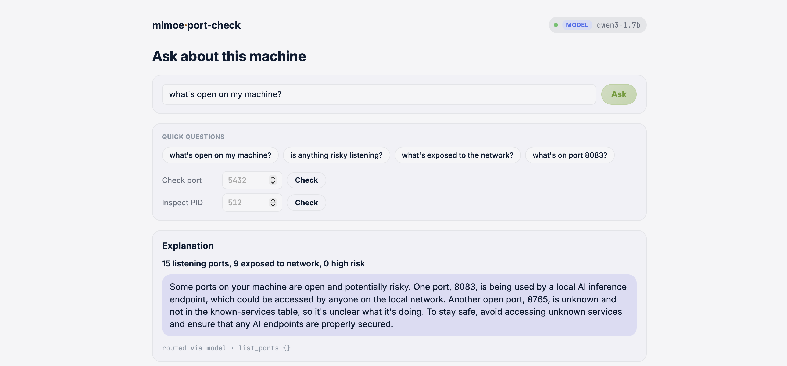
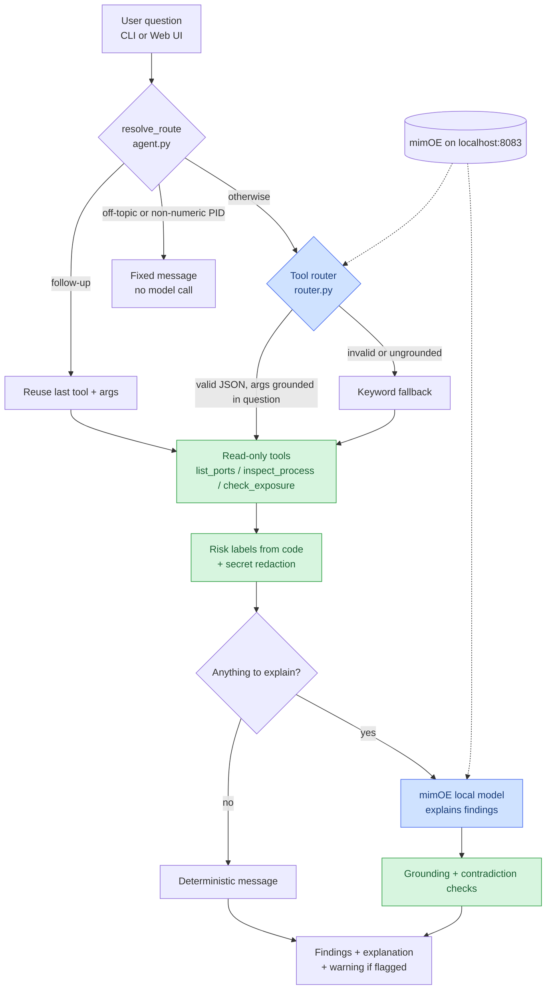
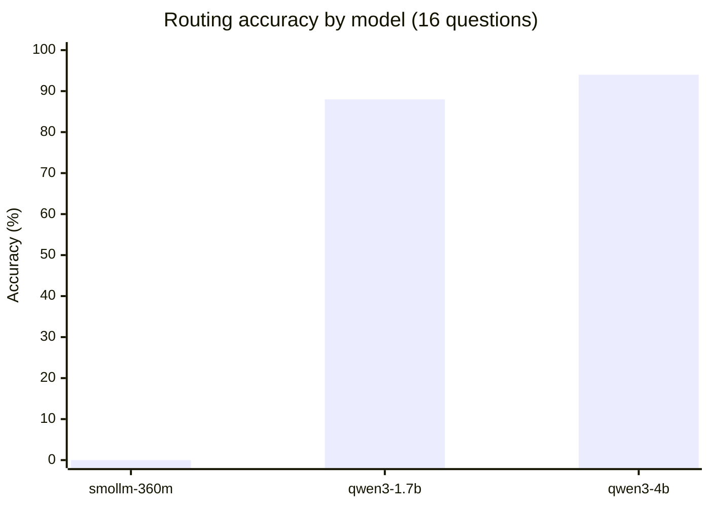
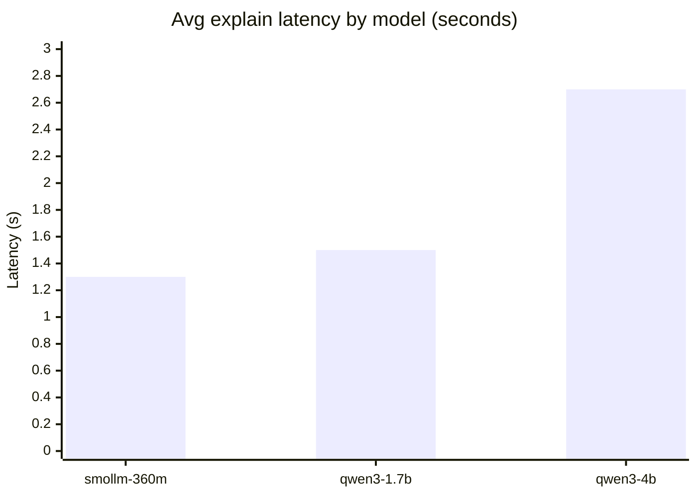

# mimoe-port-check

A small local security-check agent: it inspects listening ports and processes on this machine only, labels risk in code, never the model, and asks a model running in mimOE to explain the findings in plain language. This data is sensitive, so the agent refuses to run against anything but a localhost mimOE endpoint.



*Same agent underneath the CLI and the web UI. CLI sample transcript: [docs/DETAILS.md](docs/DETAILS.md#sample-transcript).*

## Key findings

- SmolLM2-360M scored 0/16 on routing, so the design never depends on the model to work correctly.
- Qwen3's `<think>` reasoning block consumed the entire token budget before it could answer. Fixed with a literal `/no_think` directive.
- qwen3-4b's hallucinations are more specific (fabricated port numbers) than qwen3-1.7b's, and so more believable, not less.
- The agent flags mimOE's own endpoint as network-exposed, MEDIUM risk, when its API key is left at the default shared value.
- The web UI's own listening port shows up as localhost-only, confirming the server actually binds to `127.0.0.1` as designed.

## Requirements

- macOS (`lsof`/`ps` output parsing is BSD-specific).
- Python 3.10+ (tested on 3.13).
- mimOE Studio running locally, with a model loaded. `qwen3-1.7b` is recommended, see [Model comparison](#model-comparison).

## Quick start

**CLI:**

```bash
python3 -m venv .venv && source .venv/bin/activate
pip install -r requirements.txt
cp .env.example .env      # edit if your mimOE setup differs from the defaults
python run.py
```

Ask `what's open on my machine?`, `what's on port 5432?`, or a follow-up like `is it risky?`. Type `exit` to quit.

**Web UI**, same agent underneath:

```bash
python run_web.py
```

Open http://127.0.0.1:8090.

**Tests:**

```bash
pip install -r requirements-dev.txt
pytest
```

## Design decisions

- Model picks a tool via JSON, code validates and falls back to keywords. Small local models aren't reliable at structured output, so instead of a framework's function-calling machinery, the agent asks for one small JSON object from a 3-tool whitelist and validates every field before anything runs.
- Invalid, missing, or rejected model output falls back to a deterministic keyword matcher over the user's own text, never over what the model produced. See [`router.py`](mimoe_port_check/router.py).
- No agent framework, raw `requests`, `python-dotenv` for config. A framework's function-calling layer wouldn't fix the unreliability above, and talking to mimOE is one POST to one endpoint: not worth an SDK dependency at this scale.
- Risk labels come from code, not the model. See [`tools.py`](mimoe_port_check/tools.py): HIGH (sensitive service, exposed), MEDIUM (anything else exposed), LOW (localhost-only), INFO (a recognized broadcast service like AirPlay, where exposure is expected).
- Known processes are matched by identity first, path-verified against their real executable, since a declared name is spoofable. See [docs/DETAILS.md](docs/DETAILS.md#known-process-labeling) for how, and why `mimoe` itself is a deliberate MEDIUM-not-INFO exception.

## How the components connect



Blue steps call the model (routing attempt, explanation). Green steps are owned entirely by code (tools, risk labels, guardrail checks).

## Model comparison





- qwen3-1.7b gets most of the accuracy gain at a small latency cost. qwen3-4b roughly doubles latency for another 6 points.

| Model | Routing accuracy (16 Qs) | Avg latency (route / explain) | Explain quality |
|---|---|---|---|
| `smollm-360m` | 0% (fallback does the routing) | ~410ms / ~1.3s | Loops sentences; occasionally fabricates a finding |
| `qwen3-1.7b` | 88% | ~680ms / ~1.5s | Coherent; one invented risk framing observed |
| `qwen3-4b` | 94% | ~1.35s / ~2.7s | Coherent; hallucinations more specific (fabricated ports) |

- The agent auto-selects a model at startup, preferring `qwen3-1.7b`, then `qwen3-4b`, then `smollm-360m`. `MIMOE_MODEL` in `.env` overrides this.
- `smollm-360m` is last because it ships with mimOE by default, not because it's recommended.
- Full rationale, the `/no_think` fix, and how to reproduce: [docs/DETAILS.md](docs/DETAILS.md#model-comparison).

## Security

**CLI:**

- Argument-list `subprocess` calls only, never `shell=True`. Every PID/port validated as an `int` in range before use.
- The model only ever picks from a 3-tool whitelist. Its output is parsed as JSON, never executed.
- Process names and command lines are untrusted, attacker-influenceable text. Redacted for secrets before reaching the model, and can only ever reach the explain step (printed prose), never a command argument.
- Hard refusal on a non-localhost `MIMOE_BASE_URL`, no override flag. This is what makes local inference an actual security property, not just a performance choice.
- No `sudo`, no state-changing actions. `.env` is gitignored, dependencies are minimal and pinned.

**Web UI adds:**

- Binds to `127.0.0.1` only, refuses to start otherwise.
- `Host`/`Origin` validation: DNS-rebinding and CSRF defense.
- No CORS headers, JSON-only POST, request/question size caps.
- Frontend renders via `textContent`, never `innerHTML`.
- Reasoning for each: [docs/DETAILS.md](docs/DETAILS.md#web-ui-security).

## Limitations

- The model's explanation is unreliable, so it's off the critical path. Findings show first, the model is skipped when there's nothing to explain.
- Grounding and contradiction checks flag some problems, not all. They don't catch the model contradicting the risk *level* it was given (e.g. calling LOW "not safe").
- Routing leans on the keyword fallback more than the model, especially with `smollm-360m`. A model-chosen port/pid is rejected unless that exact number appears in the question.
- The grounding, contradiction, and off-topic checks are conservative heuristics, not guarantees. Chosen to avoid false positives over catching everything.
- macOS only, UDP excluded from `list_ports`, follow-up context is a single-slot memory, not full conversation history.

## What's next

- Linux support (`/proc` or GNU `ps`/`ss` output parsing).
- Deploy as a mim inside mimOE itself, instead of a standalone CLI/server.
- Mesh discovery. mimOE can discover other instances on the LAN, not used today, since any use would need to preserve the "data never leaves this machine" guarantee.
- Constrained decoding for the explain step, if mimOE exposes one, as a stronger alternative to prompting plus grounding checks.

## How I used AI assistance

**My workflow:** curl the endpoint first to confirm it worked, get a plan approved before code, land a commit per step, tests green after each one. Full log in [`NOTES.md`](NOTES.md), written as we went, not reconstructed after.

**Where I steered or corrected:**
- Asked for a design that anticipated model unreliability (JSON-with-fallback routing, code-owned risk labels) rather than assuming a capable model, and required the redaction rule up front.
- Flagged that `mimoe`'s own endpoint getting the same INFO treatment as AirPlay/Handoff looked wrong. Confirmed the fix: MEDIUM, with a note about the default shared API key.
- Set the reproducible-evals bar for the model comparison instead of accepting a qualitative impression.
- Found a process-vs-port routing bug and off-topic gaps myself in live testing (the model parroting its last few-shot example for unrelated questions), now caught by `router.py`'s grounding check and `agent.py`'s off-topic gate.
- Asked for additional web UI hardening (Host/Origin checks, no CORS, size caps) beyond the initial plan.
- After Claude reordered findings above the model's prose on its own mid-session, reviewed and approved it after the fact, then made "ask before design decisions" a standing rule, now in `CLAUDE.md`.

**What Claude found that I verified myself:**
- A real `.env` file leaking into the test suite through `load_dotenv()`'s file-location search, undermining test isolation (`tests/test_config.py`).
- Qwen3's `<think>` block silently consuming the entire routing/explain token budget.

**Claude Code setup:** `CLAUDE.md` holds the standing project rules. Slash commands in `.claude/commands/` wrap the steps above that came up repeatedly.

| Command | Why it exists |
|---|---|
| `/eval-model <model-id>` | The model comparison numbers above came from running both evals against each loaded model in turn, not guessing. |
| `/smoke-test` | Live testing found real bugs mocked tests missed. Makes that live pass repeatable against controlled fixtures. |
| `/commit-step` | Every change landed as its own small commit, tests green first, reasoning explained. |
| `/log-session` | `NOTES.md` was written as-we-went, in a consistent format. |
| `/security-check` | Re-checks the [Security](#security) invariants before a push, not just at initial review. |
